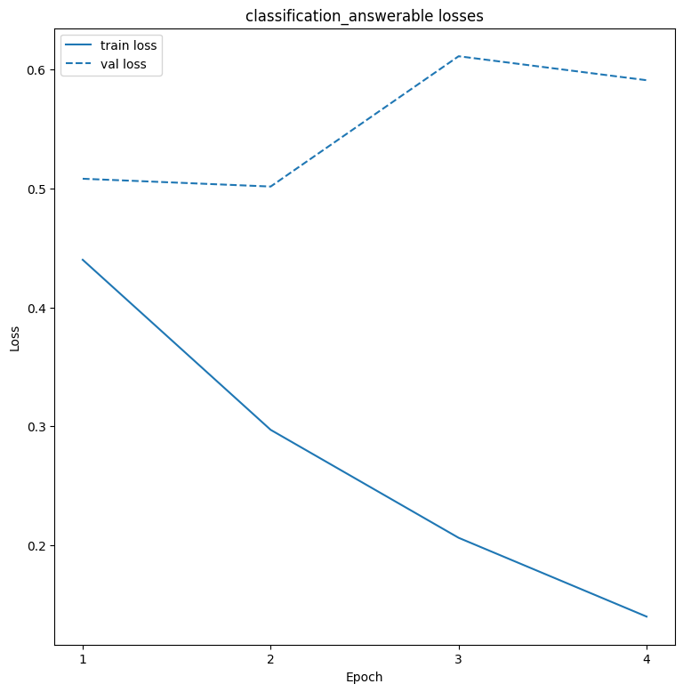
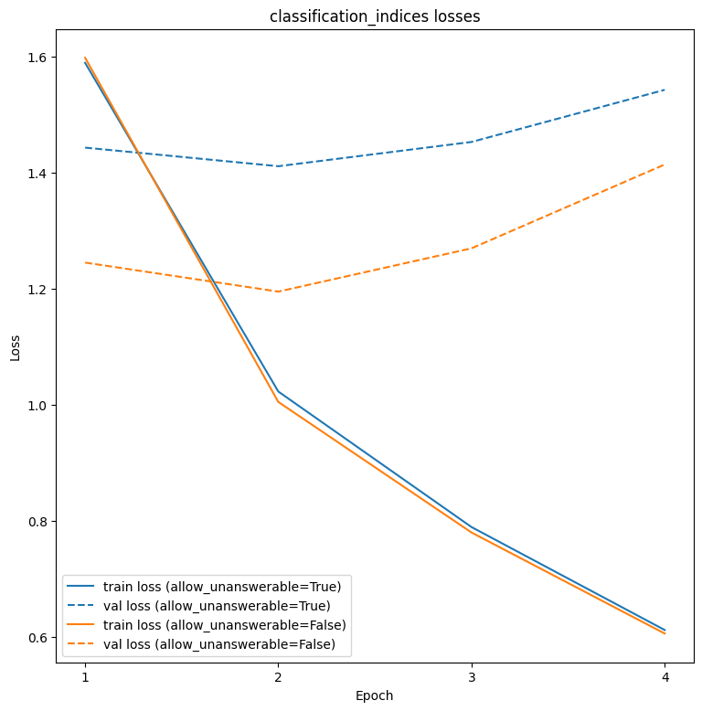
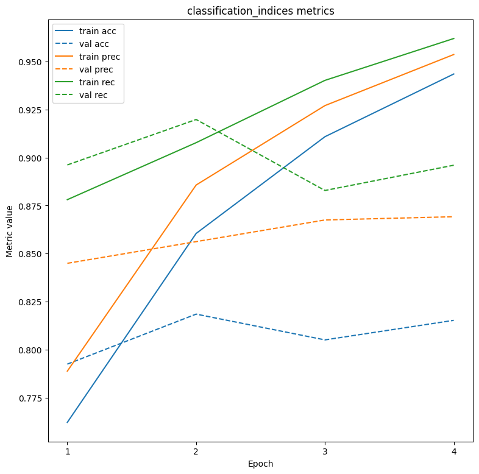
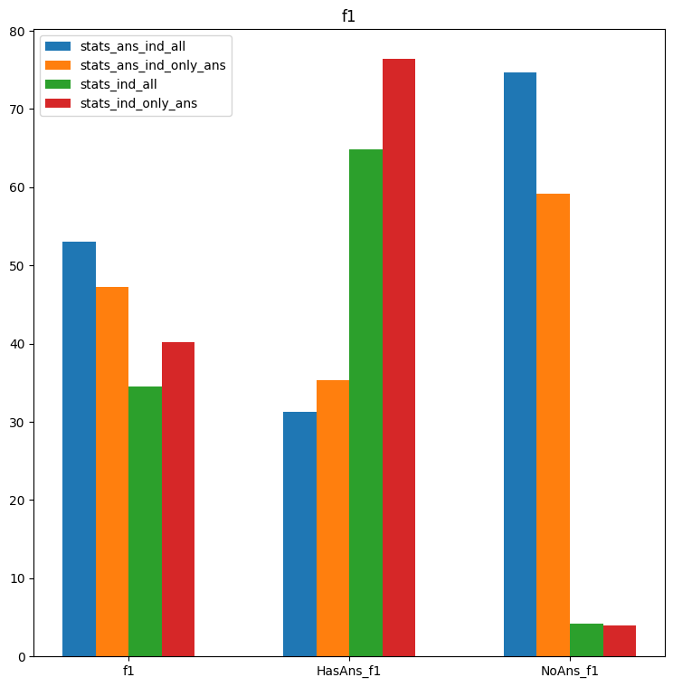
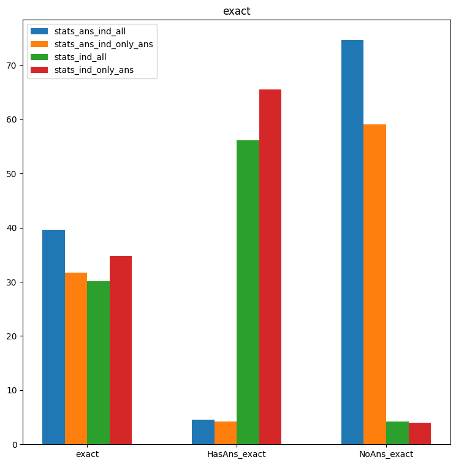

# Question Answering System for the Squad Dataset

## Methodology

### Dataset

Stanford Question Answering Dataset [SQuAD](https://rajpurkar.github.io/SQuAD-explorer/) is a reading comprehension dataset, consisting of questions posed by
crowdworkers on a set of Wikipedia articles, where the answer to every question is a segment of text, or span, from the
corresponding reading passage, or the question might be unanswerable. SQuAD2.0 combines the 100,000 questions in
SQuAD1.1 with over 50,000 unanswerable questions written adversarially by crowdworkers to look similar to answerable
ones. To do well on SQuAD2.0, systems must not only answer questions when possible, but also determine when no answer is
supported by the paragraph and abstain from answering.

During the dataset exploration it was discovered that:
1. The train dataset is imbalanced. It needs to become balanced for proper training.
  - The simplest way to balance the dataset would be to randomly sample some of the questions with answers in order for the classes to have the same size.
  - Another way would be to augment our dataset. While this could be done with external data, it would also be possible with the dataset data themselves. For each question that has an answer, we could remove the sentence that has the answer from the context. It would be a fair assumption that the question would then become unanswerable and therefore we could use such questions to increase our samples without answers. That will work in the case that the answer resides within ony one sentence in the context. We could also swap contexts between questions.
    - Note on augmentation: Similarly we could augment our questions with answers by removing random sentences from the context which do not contain the answer. Care should be taken, however, because that might lead to multiple similar samples. This would need to be validated experimentally.
2. The dev-dataset has multiple answers per question, with many of them being the same. In that case, deduplication should be applied in order to have a better picture about the model performace when the dev-set is used for evaluation.

For our purposes, a simple eperimentation will be performedm, with models being trained on the train dataset and then validated on the dev dataset. For our purpose this will be enough, but in the case of multiple trained models for comparison we should also have a test split. One way would be to use the train dataset for a train/validation split and the dev dataset as the test split.


### Model architecture

For the purposes of this assignment we will use `distilbert-base-uncased` from the transformers library. It is a fairly common model for question answering. It will be used for embedding extraction. Downstream layers will be added on top to facilitate model training. The model will be fine-tuned for experimentation.


### Experiments

We will train our model for two different tasks:
- Classification of whether a question can be answered (classification_answerable task)
- Classification of answer start and end indexes (classification_indices task)
  - The model will be trained twice: once with the full train dataset (classification_indices_all) and once using only questions that can be answered (classification_indices_only_ans)

The final pipeline will cosist of both models. First, the question goes through the binary classification model and then if it says that a question can be answered, it goes through the indices model for answer prediction. It is also possible to skip the bianary classification model in the pipeline.

A sample configuration file follows. This was the same for all experiments with the only difference being in task:

~~~yaml
train:
  seed: 42
  task: 'classification_indices'
  epochs: 4
  batch_size: 64
  num_workers: 8
model:
  pretrained_lm_name: 'distilbert-base-uncased'
  task_params:
    classification_answerable:
      downstream_head_in_size: 768
      downstream_head_out_size: 2
    classification_indices:
      downstream_head_in_size: 768
      downstream_head_out_size: 2
  lm_dropout_prob: 0.1
optimizer:
  b1: 0.9
  b2: 0.999
  eps: 1e-8
  learning_rate: 3e-5

~~~

Below we can see the losses for the model trainings. As we can see after the 2nd epoch the models seem to overfit and the validation loss stop decreasing.



We also present the classification metrics for the binary classification task.


Finally, we evaluate 4 versions of the pipeline using the official evaluation script:
- Answerable classification + Indices classification (trained using only answerable questions)
- Answerable classification + Indices classification (trained using all questions)
- Only Indices classification (trained using only answerable questions)
- Only Indices classification (trained using all questions)

The results are in the out_infer folder and below is a comparison.



From the plots above it seems that by using the binary classification model, the pipeline tends to answer more questions as unanswerable. This is most likely due to the model underperforming and would need further investiogation.

## Installation

Poetry is used for package management. To install all the dependencies

```
poetry env use 3.11
poetry install
export PYTHONPATH=.
```

Download the datasets:
~~~shell
sh data/download.sh
~~~

## Execution

### Preprocessing

First, we preprocess the Squad data to prepare them for training. We will tokenize the question-context pairs beforehand to save time during training.

Answerable classification preprocessing
~~~shell
python squad_system/nlp preprocess_data --data_path_train=data/raw/train-v2.0.json --data_path_val=data/raw/dev-v2.0.json --preprocessed_data_path=data/preprocessed/classification_answerable --pretrained_lm_name=distilbert-base-uncased --task=classification_answerable
~~~
Indices classification preprocessing (Allow unanswerable questions)
~~~shell
python squad_system/nlp preprocess_data --data_path_train=data/raw/train-v2.0.json --data_path_val=data/raw/dev-v2.0.json --preprocessed_data_path=data/preprocessed/classification_indices_all --pretrained_lm_name=distilbert-base-uncased --task=classification_indices --allow_unanswerable=True
~~~
Indices classification preprocessing (Do not allow unanswerable questions)
~~~shell
python squad_system/nlp preprocess_data --data_path_train=data/raw/train-v2.0.json --data_path_val=data/raw/dev-v2.0.json --preprocessed_data_path=data/preprocessed/classification_indices_only_ans --pretrained_lm_name=distilbert-base-uncased --task=classification_indices --allow_unanswerable=False
~~~

### Training

A sample yaml configuration file (config.yml) for the training sessions can be found in the config folder. Here you can change the parameters for training and model construction. Important to change the task parameter for different task trainings.

Answerable classification preprocessing
~~~shell
python squad_system/nlp train --cfg_path=config/config.yml --preprocessed_data_path=data/preprocessed/classification_answerable --checkpoint_path=out/classification_answerable
~~~
Indices classification preprocessing (Allow unanswerable questions)
~~~shell
python squad_system/nlp train --cfg_path=config/config.yml --preprocessed_data_path=data/preprocessed/classification_indices_all --checkpoint_path=out/classification_indices_all
~~~
Indices classification preprocessing (Do not allow unanswerable questions)
~~~shell
python squad_system/nlp train --cfg_path=config/config.yml --preprocessed_data_path=data/preprocessed/classification_indices_only_ans --checkpoint_path=out/classification_indices_only_ans
~~~

### Inference

After training, you can use the following commands to infer on the dev dataset.

Inferring with both 'classification_answerable' and 'classification_indices' models. Change the model checkpoints as needed.
~~~shell
python squad_system/nlp infer --data_path=data/raw/dev-v2.0.json --checkpoint_file_answerable=out/classification_answerable/checkpoints_model/model_ckpt_3.pt --cfg_file_answerable=out/classification_answerable/train_config.json --checkpoint_file_indices=out/classification_indices_all/checkpoints_model/model_ckpt_3.pt --cfg_file_indices=out/classification_indices_all/train_config.json --results_file_path=out_pred.json
~~~
Inferring with only 'classification_indices' model. Change the model checkpoints as needed.
~~~shell
python squad_system/nlp infer --data_path=data/raw/dev-v2.0.json --checkpoint_file_indices=out/classification_indices_all/checkpoints_model/model_ckpt_3.pt --cfg_file_indices=out/classification_indices_all/train_config.json --results_file_path=out_pred.json
~~~

The output file will have the format needed by the official evaluation [script](https://worksheets.codalab.org/rest/bundles/0x6b567e1cf2e041ec80d7098f031c5c9e/contents/blob/)
~~~json
{
    "56ddde6b9a695914005b9628": "france",
    "56ddde6b9a695914005b9629": "10th and 11th centuries",
    "56ddde6b9a695914005b962a": "denmark, iceland and norway",
    "56ddde6b9a695914005b962b": "rollo",
    "56ddde6b9a695914005b962c": "10th",
    "5ad39d53604f3c001a3fe8d1": "the normans",
    "5ad39d53604f3c001a3fe8d2": "normandy",
    "5ad39d53604f3c001a3fe8d3": "west francia",
    ...
    ...
}
~~~

## API

We have also set up a simple api using fastapi. The schema is as follows:

Inference request:
~~~json
{
  "context": "<CONTEXT>",
  "questions": [
    "<QUESTION1>",
    "<QUESTION2>",
  ]
}
~~~

Inference response
~~~json
{
  "context": "<CONTEXT>",
  "questions": [
    "<QUESTION1>",
    "<QUESTION2>",
  ],
  "answers": [
    "<ANSWER1>",
    "<ANSWER2>",
  ]
}
~~~

We can dockerize the api using:
```shell
docker build --no-cache -t squad_system:latest .
docker-compose up -d
```

For the docker-compose you need the .env file
```yml
API_KEY=... # api authentication key
```

Requests can then be send to localhost:8000
